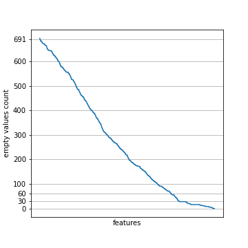
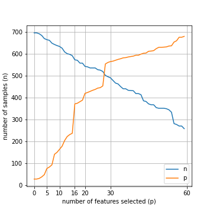

# Introduction

# Data Preparation

World Development Indicators obtained from https://databank.worldbank.org/source/world-development-indicators [@world_bank_databank]. Table \ref{table:WDIData} shows the 10 first rows out of the data file.

Table: sample from WDIData.csv file. \label{table:WDIData}

| Country Name   | Country Code   | Indicator Name   | Indicator Code   |   1960 | ...   |   2018 |
|:---------------|:---------------|:-----------------|:-----------------|-------:|:------|-------:|
| Arab World     | ARB            | Access to cl...  | EG.CFT.ACCS.ZS   |    nan | ...   | nan    |
| Arab World     | ARB            | Access to el...  | EG.ELC.ACCS.ZS   |    nan | ...   |  89.29 |
| Arab World     | ARB            | Access to el...  | EG.ELC.ACCS....  |    nan | ...   |  79.25 |
| Arab World     | ARB            | Access to el...  | EG.ELC.ACCS....  |    nan | ...   |  97.06 |
| Arab World     | ARB            | Account owne...  | FX.OWN.TOTL.ZS   |    nan | ...   | nan    |
| Arab World     | ARB            | Account owne...  | FX.OWN.TOTL....  |    nan | ...   | nan    |
| Arab World     | ARB            | Account owne...  | FX.OWN.TOTL....  |    nan | ...   | nan    |
| Arab World     | ARB            | Account owne...  | FX.OWN.TOTL....  |    nan | ...   | nan    |
| Arab World     | ARB            | Account owne...  | FX.OWN.TOTL....  |    nan | ...   | nan    |
| Arab World     | ARB            | Account owne...  | FX.OWN.TOTL....  |    nan | ...   | nan    |

Human Development Index from http://hdr.undp.org/en/data [@human_dev_index].Table \ref{table:HDI} shows the 10 first rows out of the data file.

Table: sample from HDI.csv file. \label{table:HDI}

|   HDI Rank (2018) | Country         |    1990 |    1991 | ...   |   2018 |
|------------------:|:----------------|--------:|--------:|:------|-------:|
|               170 | Afghanistan     |   0.298 |   0.304 | ...   |  0.496 |
|                69 | Albania         |   0.644 |   0.625 | ...   |  0.791 |
|                82 | Algeria         |   0.578 |   0.582 | ...   |  0.759 |
|                36 | Andorra         | nan     | nan     | ...   |  0.857 |
|               149 | Angola          | nan     | nan     | ...   |  0.574 |
|                74 | Antigua and ... | nan     | nan     | ...   |  0.776 |
|                48 | Argentina       |   0.707 |   0.714 | ...   |  0.83  |
|                81 | Armenia         |   0.633 |   0.629 | ...   |  0.76  |
|                 6 | Australia       |   0.866 |   0.867 | ...   |  0.938 |
|                20 | Austria         |   0.795 |   0.799 | ...   |  0.914 |

To join Human Development Index with World Development Indicators by Country Names, several country names had to be replaced to use the same convention in both data sets.  

The goal of the study will be to explore patterns and explain changes in the Human Development Index - HDI - our *label* or *dependent* variable. Such changes are defined as the difference between the country HDI at a given year and the HDI three years later as follows: 
$$HDI_{\Delta}=HDI_{y+3} - HDI_{y}$$
As assumption, we considered the year to year changes less informative, instead, a three year change shall provide a more robust metric of whether a sustainable change is occuring as opposed to a one-off variation (*e.g.*: natural catastrophe, formula revisions, election year book cooking). Because the quality of political institutions can be questioned in many countries, the quality of the statistics and reporting provided is also often questionable, thus, focusing on the variation makes the overall data analysis less biased by inter country variability in the quality of statistics or political institutions.
The reason to exclude the first decade available in the HDI data set is grounded on the fact that many WDI metrics and countries had no reliable statistical reporting prior to the institution consolidation that followed the 1989 fall of Berlin Wall and the end of yugoslav civil war, so 1990 and 1995 HDI reporting were excluded.  

The World Development Indicators, our *independent* or *explanatory* variables or *features*, were also preprocessed to include variations over the course of, in this case, 2 years ($WDI_{\Delta} = WDI_y - WDI_{y-2}$), the hipothesis is that the increasing or decreasing trend can contribute as predictor for the label variable. Notice also that the labels associated the World Development Indicators at a given year ($HDI_y$), are caculated as the difference between the HDI three years into the future and the HDI at the given year ($HDI_{\Delta}=HDI_{y+3} - HDI_{y}$).
Taking all into account, a 5 year period is contributing to every given sample and thus, to maximize sample independence, we are not overlapping periods in the process of producing the samples out of the WDI and HDI data sets, instead, we will build one sample for each country every five years (since 1998 up to 2018).
Moreover, the Human Development Index is a derived metric that uses variables in the WDI data set, thus, avoinding time overlaps and predicting the deltas is what prevents us from going in the direction of less interesting conclusions such as finding the HDI formula (a reverse-engineering task).  

Both datasets have several country aggregates derived from countries already represented in the data set (dependent samples). For that reason we discarded aggregates from both data sets. Aggregates such as "East Asia and the Pacific", "Europe and Central Asia", "Latin America and the Caribbean", "South Asia", "Sub-Saharan Africa" or "Least Developed Countries".

There is a need to unpivot the data sets from wide to long format before concatenating all data along the rows.

Finally, all variables can become represented as columns by pivoting the concatenated rows. The result is a conventional tabular data set still quite populated with nulls. 

As a first step to avoid empty values in the variables, we will find the list of metrics that have higher number of empty values, usually meaning that such metric is only available for few countries or for very recent years.
We will rank the metrics from the one with the most empty values (close to 691 - \ref{fig1}) down to the one with the least empty values (0 - \ref{fig1}) and visually identify an elbow that would help us decide for a reasonable number of empty values to tolerate in our selection of varibles to include in the data set.

{width=60%}

There is an elbow below 60 empty values (\ref{fig1}) thus, for a range between 0 and 60 empty values, we will perform a detailed inspection of the balance between the chosen number of features and the number of samples that will remain after discarding samples having one or more empty values.

{width=60%}

The result is the chart from figure \ref{fig2}. There we can observe that we wish to have more features our decision shall move towards tolerating 30 empty values, as already observed in figure \ref{fig1}. On the other hand, if we want to maximize the number of independent samples, then our decision shall approximate 16 empty values. Once our concern was more in the direction of maximizing the number of independet samples (already scarce from the start), we decided to tolerate 16 empty values.

Table \ref{table:WDI} shows the 10 first rows out of the prepared data file.

Table: sample from WDI.csv file. \label{table:WDI}

| Country - Year   |   Population a... |   GDP deflator... |   Fixed teleph... | ...   |   $HDI_{\Delta}$ |
|:-----------------|------------------:|------------------:|------------------:|:------|-----------------:|
| Afghanistan ...  |             15260 |           249.1   |            102600 | ...   |            0.006 |
| Albania - 2000   |              2707 |            66.62  |            136300 | ...   |            0.02  |
| Albania - 2005   |              4127 |            81.27  |            269510 | ...   |            0.022 |
| Albania - 2010   |              5398 |            96.38  |            346600 | ...   |            0.041 |
| Albania - 2015   |              4875 |           104.9   |            247884 | ...   |            0.003 |
| Algeria - 2000   |             32408 |           104.3   |           1613000 | ...   |            0.03  |
| Algeria - 2005   |             26010 |           153     |           2379000 | ...   |            0.017 |
| Algeria - 2010   |             34320 |           230.6   |           2856012 | ...   |            0.016 |
| Algeria - 2015   |             45600 |           302.9   |           3166000 | ...   |            0.008 |
| Angola - 2000    |              4730 |             8.144 |             65730 | ...   |            0.034 |

# Statistical Analysis

# Statistical Modeling

# Models comparison and result analysis

# Conclusion

# References
